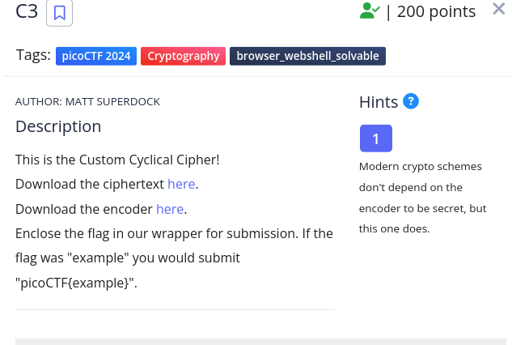
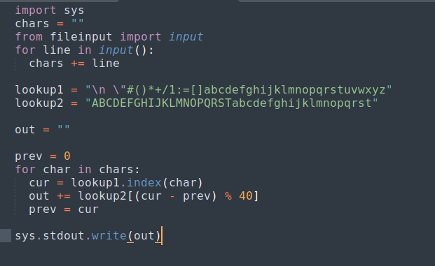
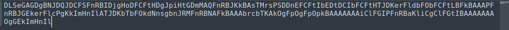
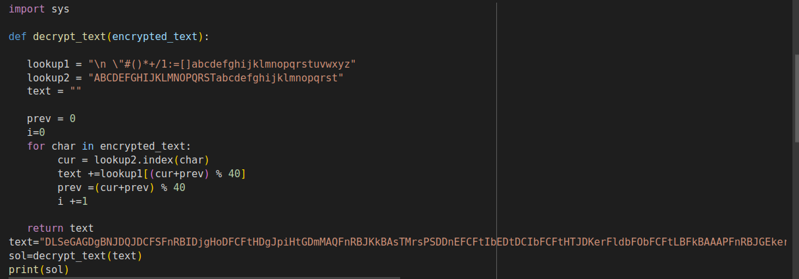
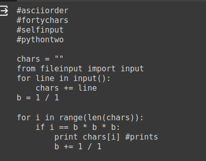
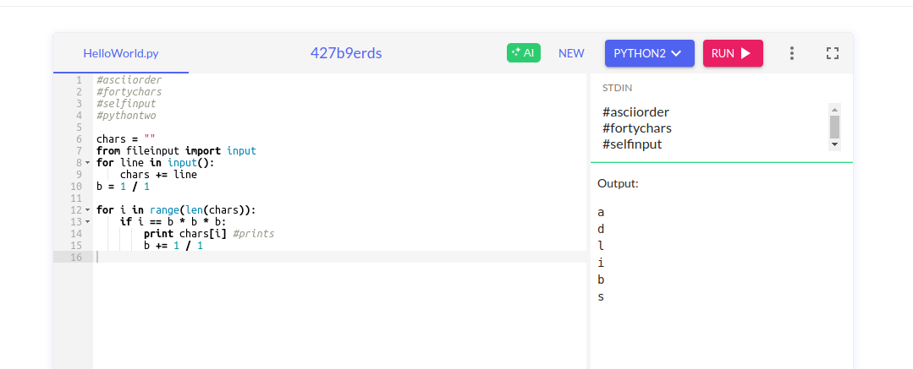

<h1>C3</h1>

<h3>Description:</h3>

<h4>this is the code given called convert.py</4>

<h4>And this is the ciphertext</4>

<h3>Solution:</h3>

<h4>1/Search for the reverse of this code </h4>

<h4>2/run it using any code editor (i use google colab here) ,and see the result </h4>

<h4>it seems like other code so i search about fortychars , and i see the same code as mine </h4>

so i just copied the result with picoctf{} and it was correct so 

<h4> THE FLAG: </h4>
             picoCTF{adlibs}

