<h1>Blast from the past</h1>

<h3>Description:</h3>

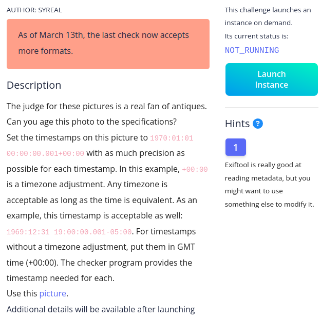

<h3>Solution:</h3>

<h4>1/Download the file </h4>

<h4>2/read very well the description because it's the helf of the answer </h4>

<h4>3/run the command exiftool path/to/orginal.jpg</h4>

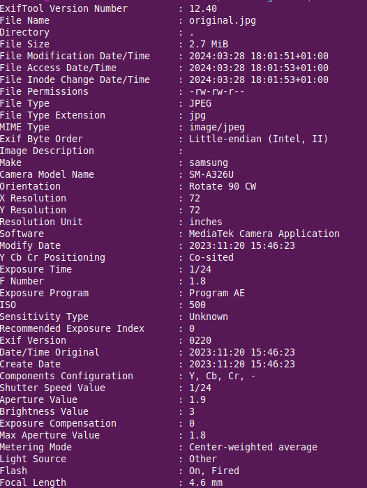

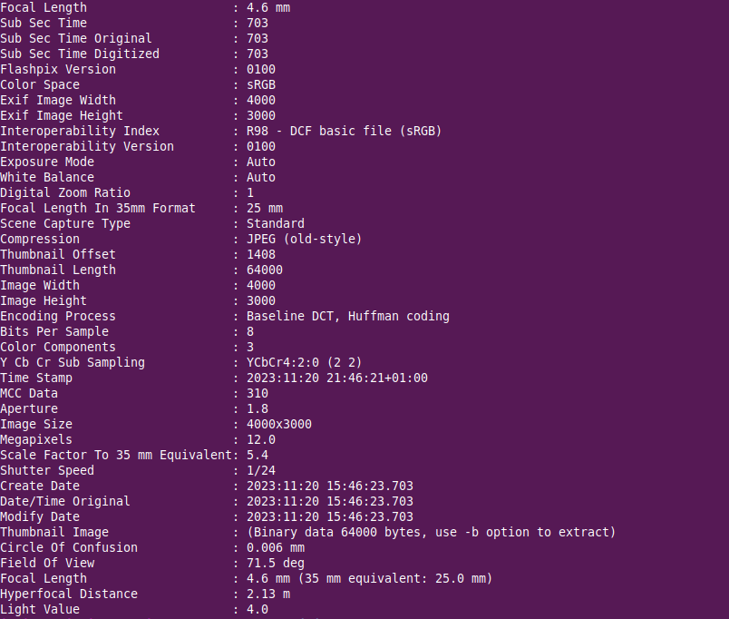

<h4>4/run this command exiftool -AllDates="1970:01:01 00:00:00" /path/to/original.jpg</h4>
because he want to change the timezone of the picture that it was in 2023:11:20 21:46:21+01:00, everything gonna change using this command but  the Time Stamp stay the same 

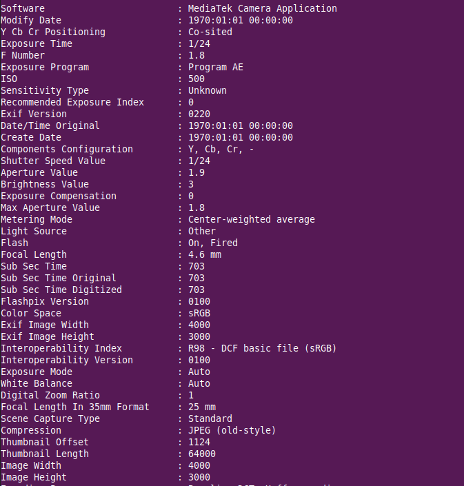

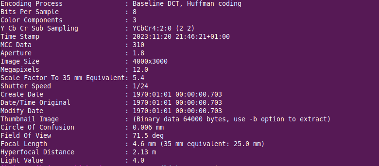

<h4>5/open the modified  file in any hexeditor tool (i use hexed.it)</h4>
<h4>6/search about this date 1970 </h4>
i don't find it in the first time but i find this 

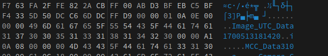
 
 it seems like it is in milliseconds

<h4>7/search a converter in unix system to find this https://www.epochconverter.com/  </h4>

i type the previous number 

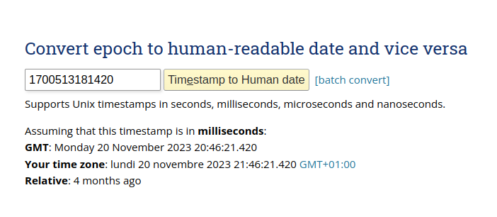

<h4>8/type the timestump that you need  to get the number in millisconds </h4>

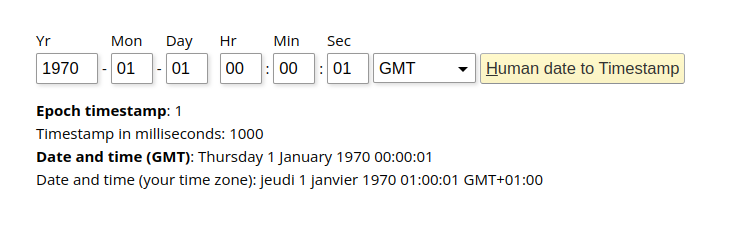

<h4>9/we should now replace the result in the editor and replacing 00 by .. for avoiding the damage of the file  </h4>

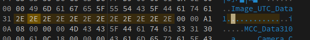

<h4>10/Save the file and launch the instance  </h4>

<h4>11/run those commands</h4>

nc -w 2 mimas.picoctf.net <port> < original_modified.jpg

nc -d mimas.picoctf.net <port>

Oops !! i think should we change this also 

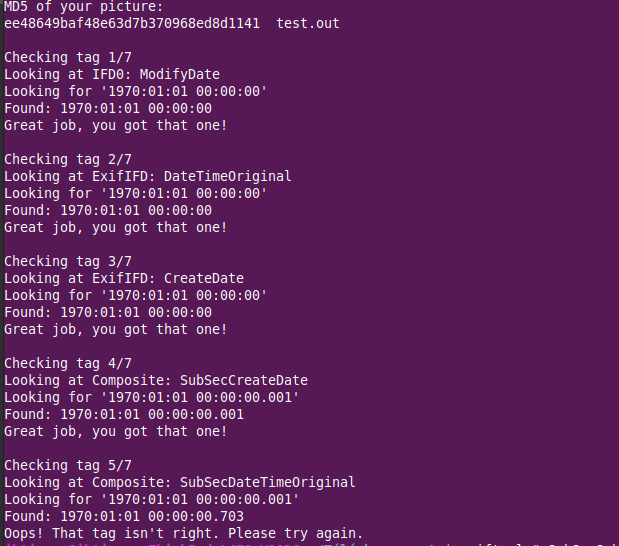

<h4>12/run this command </h4>
exiftool "-SubSecCreateDate=1970:01:01 00:00:00.001" "-SubSecDateTimeOriginal=1970:01:01 00:00:00.001" "-SubSecModifyDate=1970:01:01 00:00:00.001" original.jpg

<h4>execute again the commands of netcat  </h4>

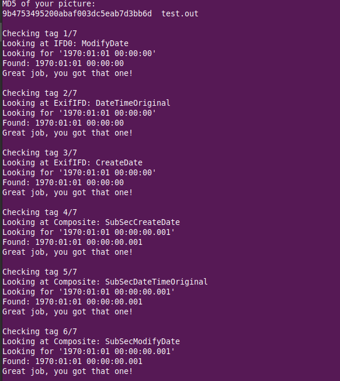

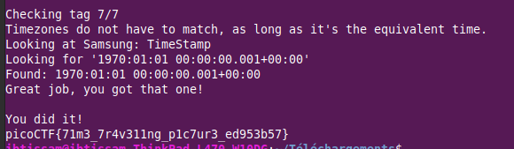

<h4> THE FLAG: </h4>
              picoCTF{71m3_7r4v311ng_p1c7ur3_ed953b57}

