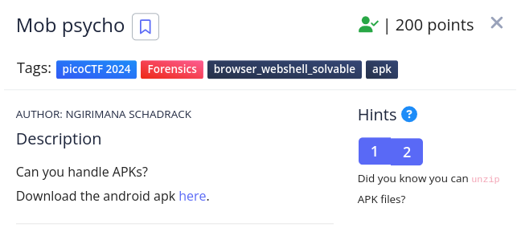
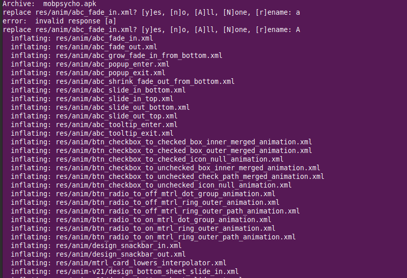
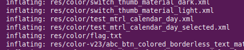

<h1>Mob psycho</h1>

<h3>Description:</h3>

<h3>Solution:</h3>

<h4>1/Download the apk file </h4>

<h4>2/following the hint and do this command</h4>
  unzip mobpsycho.apk 

<h4>3/just seeing the extracted files and noting this </h4>

<h4>4/run the command cat res/color/flag.txt</h4>

<h4>5/decode it in any decoder online or tool and than </h4>

<h4> THE FLAG: </h4>
              picoCTF{ax8mC0RU6ve_NX85l4ax8mCl_746dfa39}

 
