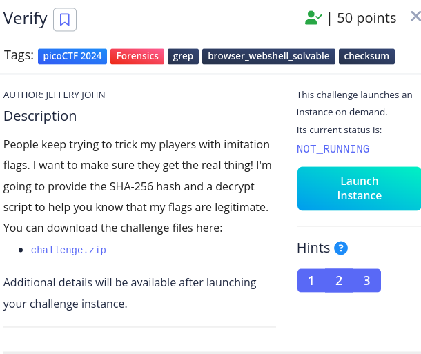
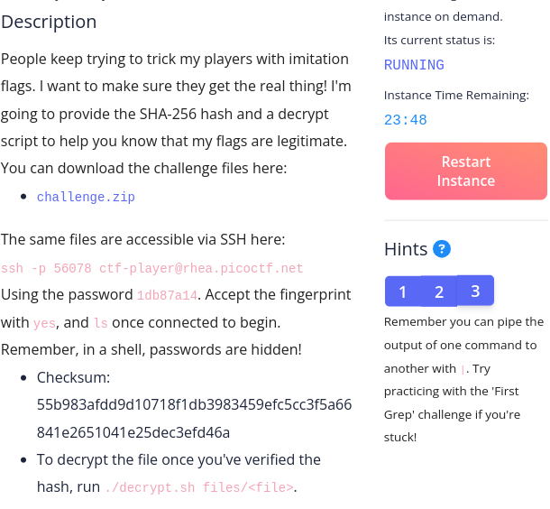
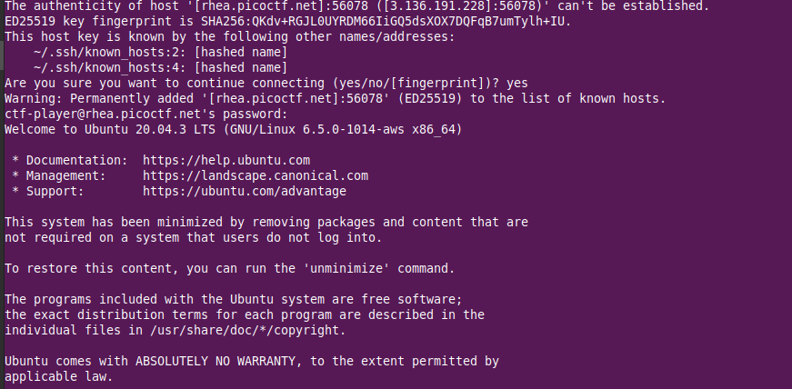
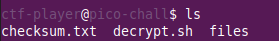
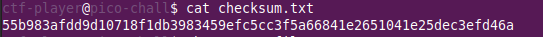
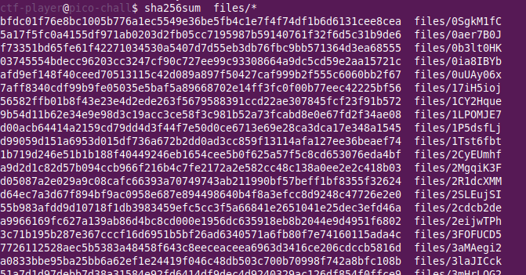
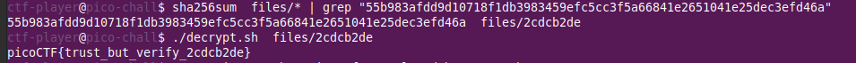

<h1>Verify</h1>

<h3>Description:</h3>

<h3>Solution:</h3>

<h4>1/launch instance</h4>

<h4>2/run in terminal </h4>
ssh -p <port> ctf-player@rhea.picoctf.net

<h4>3/tab yes and use the password that it gives you</h4>

<h4>4/tab ls</h4>

<h4>5/check checksum.txt </h4>

<h4> 6/check all files using this command sha256sum</h4>

<h4>7/use it now for the SHA-256 that you find it in checksum.txt and run the command indicated  in the challenge now </h4>

<h4> THE FLAG: </h4>
              picoCTF{trust_but_verify_2cdcb2de}

