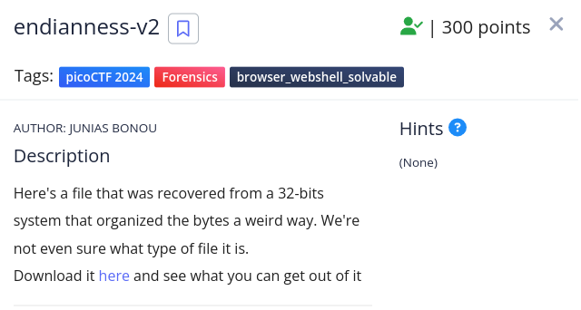
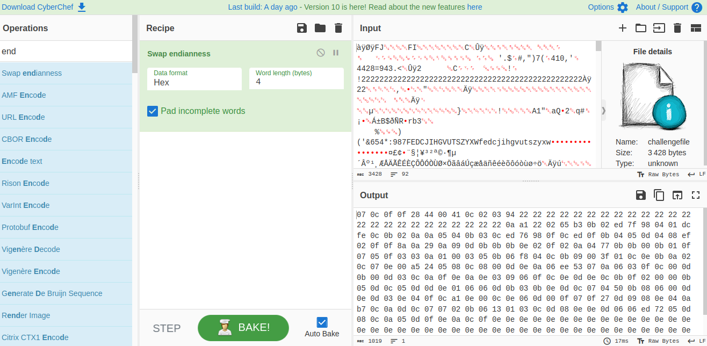
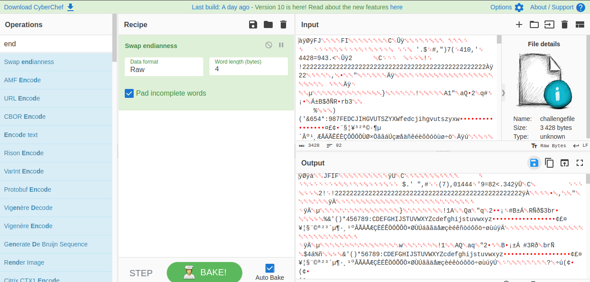

<h1>endianness-v2</h1>

<h3>Description:</h3>

<h3>Solution:</h3>

<h4>1/Download the file </h4>

<h4>2/from the title of the challenge is something related to endianness swap</h4>

<h4>3/run the command exiftool path/to/challengefile</h4>

it seems like it's jpeg file 

<h4>4/go to cyberchef and upload the file there  </h4>
<h4>5/search about endianness </h4>

<h4>6/use this recipe and use data format as raw to get the image  and bake</h4>

<h4>6/upload the output and you get the image </h4>

<h4> THE FLAG: </h4>
              picoCTF{cert!f1Ed_iNd!4n_s0rrY_3nDian_94cc03f3}

